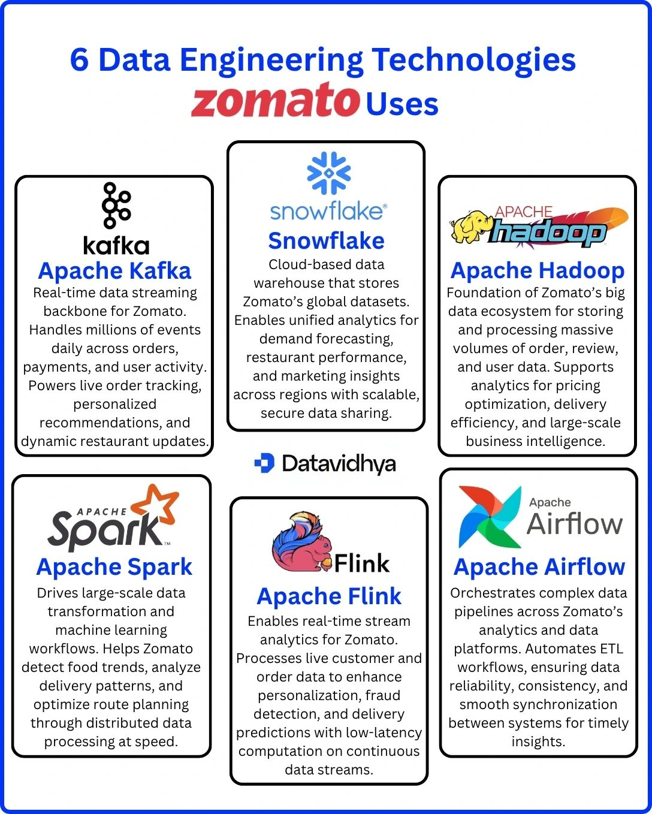
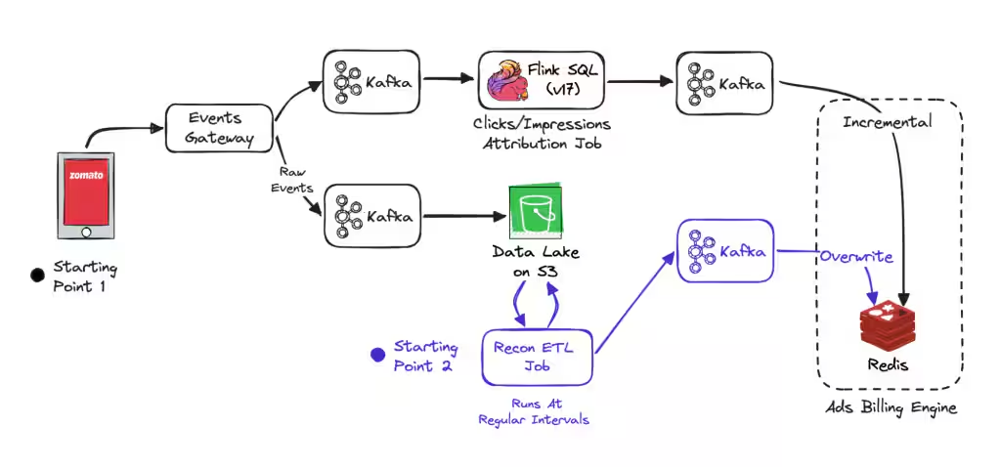
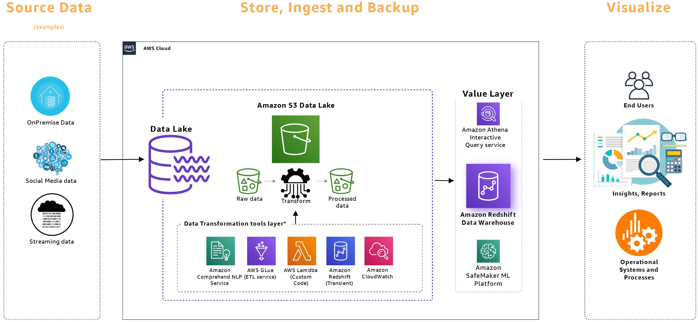

# Event-Driven Data Engineering Platform

**Learning Path: Building Real-Time Data Pipelines from Scratch**

I wanted to learn data engineering, so I learned by building projects - from basic concepts to production-grade systems.

---

## Learning Path

### 1. PySpark Fundamentals ✅

**Location:** `learntools/pyspark/`

Master distributed data processing concepts:

- DataFrames, RDDs, transformations vs actions
- Partitioning, shuffling, skew handling
- Joins (broadcast, sort-merge, shuffle hash)
- Caching strategies (memory, disk, serialized)
- Query optimization and execution plans

📖 [See PySpark README](learntools/pyspark/README.md)

---

### 2. Apache Kafka ✅

**Location:** `learntools/kafka/`

Learn distributed streaming and message queuing:

- Producer/Consumer architecture
- Topics, partitions, replication factor
- Message ordering guarantees
- Real-time ingestion patterns
- Fault tolerance and exactly-once semantics

📖 [See Kafka README](learntools/kafka/README.md)

---

### 3. Mini Project 1: Kafka + Spark Streaming ✅

**Location:** `learntools/miniproject1/`

**What You'll Learn:**
Real-time order processing pipeline using Kafka producers and Spark Structured Streaming for live data transformation.

📖 [See Mini Project 1 README](learntools/miniproject1/README.md)

---

### 4. Apache Airflow ✅

**Location:** `learntools/airflow/`

Master workflow orchestration:

- DAGs, tasks, operators
- TaskFlow API (Airflow 2.x)
- Scheduling, backfilling, catchup
- XCom for inter-task communication
- Error handling and retries

📖 [See Airflow README](learntools/airflow/README.md)

---

### 5. Mini Project 2: Medallion Architecture ✅ COMPLETED

**Location:** `learntools/miniproject2/`

**What You'll Learn:**
End-to-end ETL pipeline simulating Zomato delivery analytics - streaming ingestion (1000 events/sec), batch processing with Airflow + PySpark, Hive-style partitioning, all running locally.

**Achievements:**

- 11M+ events processed
- 79 Bronze files (9.1GB)
- 241+ CSV replay cycles
- Silver/Gold layers populated

📖 [See Mini Project 2 README](learntools/miniproject2/README.md)

---

### 6. Apache Flink 🚧 IN PROGRESS

**Location:** `learntools/flink/`

Advanced stream processing:

- Stateful computations
- Event time processing
- Windowing (tumbling, sliding, session)
- Watermarks and late data handling
- Exactly-once state consistency

📖 [See Flink README](learntools/flink/README.md)

---

## Major Project: Zomato Real-Time Data Engineering Platform 🎯 NEXT

### Technologies Stack

We're using free Apache-based open-source stack:



- **Apache Kafka** - Real-time data streaming
- **Apache Hadoop** - Big data storage foundation
- **Apache Spark** - Large-scale data transformation
- **Apache Flink** - Real-time stream processing
- **Apache Airflow** - Workflow orchestration
- **Snowflake** - Cloud data warehouse for storage

### What We're Building



**Real-time ads billing simulation for Zomato:**

- Events Gateway → Kafka → Flink SQL processes clicks/impressions
- Raw events stored in Data Lake
- Recon ETL Job runs at regular intervals
- Kafka publishes incremental updates
- Redis caches data for Ads Billing Engine

### Reference Architecture



Example of complete data engineering cycle using Amazon stack (for reference only).

---

## Project Structure

```
FlowGuard/
├── learntools/
│   ├── pyspark/          # Distributed data processing ✅
│   ├── kafka/            # Streaming and messaging ✅
│   ├── miniproject1/     # Kafka + Spark integration ✅
│   ├── airflow/          # Workflow orchestration ✅
│   ├── miniproject2/     # Medallion ETL pipeline ✅
│   └── flink/            # Advanced stream processing 🚧
│
└── major-project/        # Production Zomato simulation 🎯
    ├── kafka-cluster/    # Multi-broker setup
    ├── flink-jobs/       # Real-time processing
    ├── airflow-dags/     # Batch orchestration
    ├── snowflake-setup/  # Data warehouse config
    └── monitoring/       # Prometheus + Grafana
```

---

## Progress Timeline

- I actually learnt these all within 2 weeks,watched short yt videos read blogs and build project alongside to learn.

## References

- [Zomato Tech Blog on Data Engineering](https://www.zomato.com/blog/eliminating-bottlenecks-in-real-time-data-streaming-a-zomato-ads-flink-journey/)

- [Notion Tracker](https://www.notion.so/January-2db64cdddab780468bace3df7d1592ae)

- [Medallion Architecture](https://medium.com/@yudayreddy1/understanding-bronze-silver-and-gold-layers-in-data-engineering-5dd748b71d35)

---

**Current Status**: Mini Project 2 Completed ✅ | Starting Flink 🚧  
**Next**: Flink fundamentals → Major Project kickoff
