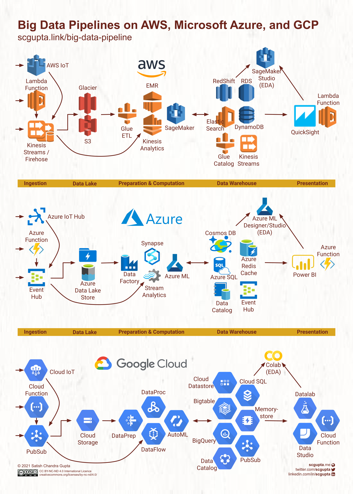

# Event-Driven Data Engineering Platform

**Learning Path: Building Real-Time Data Pipelines from Scratch**

I wanted to learn data engineering, so I learned by building projects - from basic concepts to production-grade systems.

---

## Learning Path

### 1. PySpark Fundamentals ✅

**Location:** `learntools/pyspark/`

Master distributed data processing concepts:

- DataFrames, RDDs, transformations vs actions
- Partitioning, shuffling, skew handling
- Joins (broadcast, sort-merge, shuffle hash)
- Caching strategies (memory, disk, serialized)
- Query optimization and execution plans

📖 [See PySpark README](learntools/pyspark/README.md)

---

### 2. Apache Kafka ✅

**Location:** `learntools/kafka/`

Learn distributed streaming and message queuing:

- Producer/Consumer architecture
- Topics, partitions, replication factor
- Message ordering guarantees
- Real-time ingestion patterns
- Fault tolerance and exactly-once semantics

📖 [See Kafka README](learntools/kafka/README.md)

---

### 3. Mini Project 1: Kafka + Spark Streaming ✅

**Location:** `learntools/miniproject1/`

**What You'll Learn:**
Real-time order processing pipeline using Kafka producers and Spark Structured Streaming for live data transformation.

📖 [See Mini Project 1 README](learntools/miniproject1/README.md)

---

### 4. Apache Airflow ✅

**Location:** `learntools/airflow/`

Master workflow orchestration:

- DAGs, tasks, operators
- TaskFlow API (Airflow 2.x)
- Scheduling, backfilling, catchup
- XCom for inter-task communication
- Error handling and retries

📖 [See Airflow README](learntools/airflow/README.md)

---

### 5. Mini Project 2: Medallion Architecture ✅ COMPLETED

**Location:** `learntools/miniproject2/`

**What You'll Learn:**
End-to-end ETL pipeline simulating Zomato delivery analytics - streaming ingestion (1000 events/sec), batch processing with Airflow + PySpark, Hive-style partitioning, all running locally.

**Achievements:**

- 11M+ events processed
- 79 Bronze files (9.1GB)
- 241+ CSV replay cycles
- Silver/Gold layers populated

📖 [See Mini Project 2 README](learntools/miniproject2/README.md)

---

### 6. Apache Flink

**Location:** `learntools/flink/`

Advanced stream processing:

- Stateful computations
- Event time processing
- Windowing (tumbling, sliding, session)
- Watermarks and late data handling
- Exactly-once state consistency

📖 [See Flink README](learntools/flink/README.md)

---

## Major Project: Zomato Real-Time Data Engineering Platform 🎯 NEXT

### Technologies Stack

We're using free Apache-based open-source stack:


- **Apache Kafka** - Real-time data streaming
- **Apache Hadoop** - Big data storage foundation
- **Apache Spark** - Large-scale data transformation
- **Apache Flink** - Real-time stream processing
- **Apache Airflow** - Workflow orchestration
- **Snowflake** - Cloud data warehouse for storage

### What We're Building


**Real-time ads billing simulation for Zomato:**

- Events Gateway → Kafka → Flink SQL processes clicks/impressions
- Raw events stored in Data Lake
- Recon ETL Job runs at regular intervals
- Kafka publishes incremental updates
- Redis caches data for Ads Billing Engine

### Reference Architecture


Example of complete data engineering cycle using Amazon stack (for reference only).

### Managed Data Engineering Tools



Cloud providers (AWS, Azure, Google Cloud) offer managed tools for big data pipelines - these handle infrastructure, scaling, and maintenance automatically.

---

## Project Structure

```
FlowGuard/
├── learntools/
│   ├── pyspark/          # Distributed data processing ✅
│   ├── kafka/            # Streaming and messaging ✅
│   ├── miniproject1/     # Kafka + Spark integration ✅
│   ├── airflow/          # Workflow orchestration ✅
│   ├── miniproject2/     # Medallion ETL pipeline ✅
│   └── flink/            # Advanced stream processing 🚧
│
└── major-project/        # Production Zomato simulation 🎯
    ├── kafka-cluster/    # Multi-broker setup
    ├── flink-jobs/       # Real-time processing
    ├── airflow-dags/     # Batch orchestration
    ├── snowflake-setup/  # Data warehouse config
    └── monitoring/       # Prometheus + Grafana
```

---

## Progress Timeline

- I actually learnt these all within January along side external exams (but challenge is a challenge:),watched short yt videos read blogs and build project alongside to learn. Didnt read books I have not mastered everything but know the basics and moving towards intermediate level by reading books,blogs and building projects.

  The Intention Behind Data-Engineering was simple we had data engineering and MLOPS subject in our curriculum but mostly we read theories and how acutally it works behind scenes how does industry uses this what tools are there in the market and most importantly how to think like a data engineer.Though i have not integrated this to production with CI/CD ,testing and monitoring,but i dont think those are too complex,mostly the intention was to learn what actually data engineering is but i know this full repo is for basics with small projects to learn.For further path books and projects are the ways to grow.
  I enjoyed this month's journery and challenge.Will come up amazing projects in different domains but integrating data engineering might be for ai agents,or real time analysis.

  Look if you think i dont know azure data engineering tools or any managed data engineering tools or stack that's fine because you can learn it on the go its all on your fundamentals and data modeling.

  If you want to be data engineer you have to be well versed with these are to main skills
  - SQL
  - Python or Java (python is easier to learn and implement but java is more used in industry for data engineering but depends on company to company)
  - Data Modeling
  - Cloud Basics (must be able to work with atleast one cloud provider later on you can switch based on requirements)
    (Note these are must have skills later on you can learn more tools and technologies every tool has some advantages on requirements later on you can learn databricks ,dbt,snowflake,redshift,bigquery etc it's all based on requirement)
    i think is required for data engineers for further progress you can read the blogs and tutorials i have given in the notion.

- Happy Learning and Building! 👨🏻‍💻 ❤️

## References

## Books: Read this :

Start with Fundamentals of DataEngineering book

📖 [Read Books](</books/Fundamentals%20of%20Data%20Engineering%20(Reis,%20JoeHousley,%20Matt)%20(Z-Library).pdf>)

This notion Tracker has everything you need should check it out once.

- [Notion Tracker](https://www.notion.so/January-2db64cdddab780468bace3df7d1592ae)

## Additional books link if you want to explore more

- Books (https://github.com/letthedataconfess/Data-Engineering-Books/tree/main?tab=readme-ov-file#readme)

## Additional Blogs though included in notion tracker

- [Zomato Tech Blog on Data Engineering](https://www.zomato.com/blog/eliminating-bottlenecks-in-real-time-data-streaming-a-zomato-ads-flink-journey/)

- [Medallion Architecture](https://medium.com/@yudayreddy1/understanding-bronze-silver-and-gold-layers-in-data-engineering-5dd748b71d35)

---

**Current Status**: Working on Major Project - Zomato Real-Time Data Engineering Platform with Next.js ,fastapi backend,PG sql for db, multi-cluster with multi-borker kafka, and has event gateway which goes to two pipeline for real time processing with flink and batch processing with airflow and pyspark and snowflake for data warehousing.
**Next**: Flink fundamentals → Major Project kickoff
