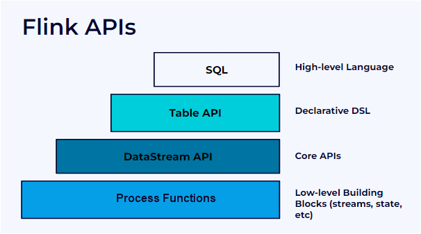
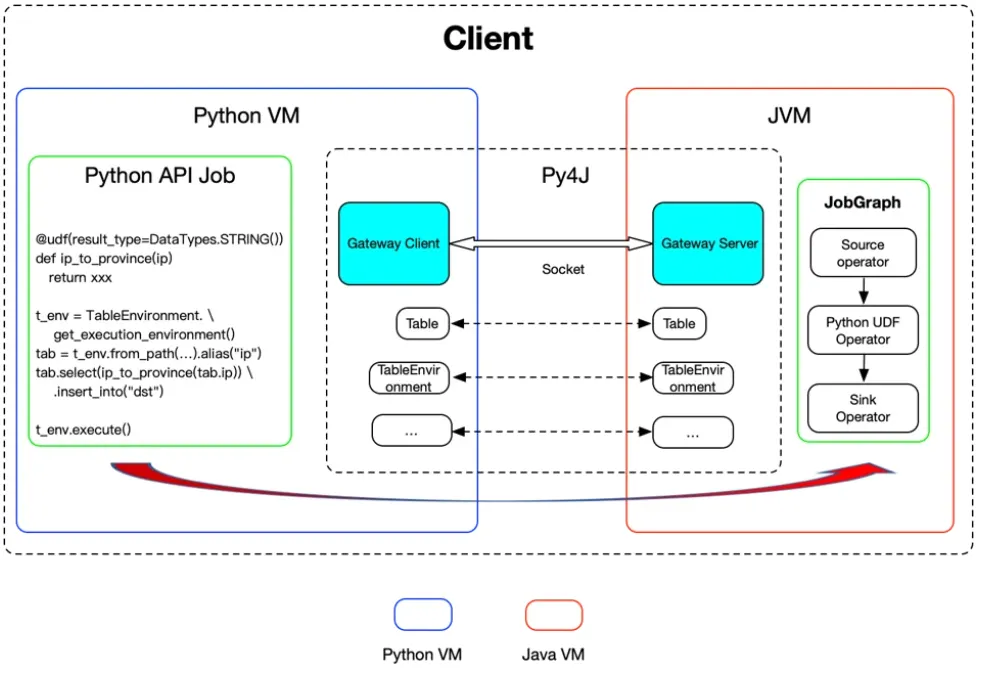

# Apache Flink: Real-Time Stream Processing

Learn streaming concepts with Flink examples.

**Official Documentation**: https://flink.apache.org/

---

## Flink API Layers



Flink provides multiple abstraction levels:

- **SQL**: High-level declarative queries (easiest)
- **Table API**: Declarative DSL for relational operations
- **DataStream API**: Core streaming APIs (most control)
- **Process Functions**: Low-level building blocks for custom state, timers, and event processing
  **Which to use?** Start with DataStream API for learning core concepts, move to Table API/SQL for production productivity.

---

## Python + Flink Architecture



**PyFlink uses Py4J** to bridge Python and Java:

- Python API Job runs in Python VM
- Actual execution happens in JVM (Flink runtime)
- Gateway Client/Server handles communication via sockets
- Python UDFs can be embedded in JobGraph

**Why this matters**: Understanding this helps debug performance issues and limitations in PyFlink vs native Java Flink.

---

## Stateless vs Stateful Processing

### Stateless

Output depends **only on current event**. No memory, no history.

```python
# Stateless: map, filter
stream.map(lambda e: (e["user_id"], e["amount"]))
stream.filter(lambda e: e["amount"] > 100)
```

**Examples**: JSON parsing, filtering, unit conversions

---

### Stateful

Operator **remembers information across events**.

```python
# Stateful: count per user
state[user_id].count += 1
```

**Key requirement**: Use `key_by` first!

```python
stream.key_by(lambda e: e["user_id"])
```

**Why keying matters**:

- All events for a user go to same operator
- State isolated per user
- No race conditions

**Examples**: Transaction counters, rolling averages, session tracking


---

## What is a Sink?

A sink is a **side-effect boundary** where the stream affects the outside world.

```python
stream.add_sink(MySink())
```

**Examples**: Write to Kafka, trigger alert, block transaction

**Sink semantics**:

- **At-most-once**: Fast, unsafe (data loss possible)
- **At-least-once**: Duplicates possible
- **Exactly-once**: Requires coordination

**Important**: Sinks must be **idempotent** (safe to retry) to avoid duplicate actions.

---

## Core Streaming Concepts

### 1. Event Time

Events carry timestamps. Flink reasons about **when things happened**, not when they arrived.

```python
event_time = event["timestamp"]
```

---

### 2. Watermarks

Define **when to trigger computations** on late events.

```python
WatermarkStrategy.for_bounded_out_of_orderness(
    Duration.of_seconds(5)
)
```

Trade-off: Correctness vs latency

---

### 3. Keyed Streams

Partition data by key for parallel processing with isolated state.

```python
stream.key_by(lambda event: event["user_id"])
```

---

### 4. Stateful Processing

Maintain state across events per key.

```python
class CountFunction(KeyedProcessFunction):
    def open(self, context):
        self.state = context.get_state(
            ValueStateDescriptor("count", Types.INT())
        )

    def process_element(self, event, ctx):
        count = self.state.value() or 0
        count += 1
        self.state.update(count)
        yield f"Count: {count}"
```

---

### 5. Windows

Time-bounded computations. Define when memory can be released.

```python
stream \
    .key_by(lambda e: e["user_id"]) \
    .window(TumblingEventTimeWindows.of(Time.seconds(60))) \
    .aggregate(SumAggregator())
```

**Types**:

- **Tumbling**: Non-overlapping (0-60s, 60-120s)
- **Sliding**: Overlapping (0-60s, 30-90s)
- **Session**: Gap-based

---

### 6. Timers

Trigger actions after time delay or detect inactivity.

```python
def process_element(self, event, ctx):
    # Trigger action in 60 seconds
    ctx.timer_service().register_event_time_timer(
        event["timestamp"] + 60000
    )

def on_timer(self, timestamp, ctx):
    # Triggered after delay
    ctx.output("Timer fired")
```

**Use case**: "If no activity for 10 minutes, reset risk score"

---

### 7. Checkpointing

Snapshots of computation + state. Enables fault tolerance.

```python
env.enable_checkpointing(10000)  # Every 10 seconds
env.get_checkpoint_config().set_checkpointing_mode(
    CheckpointingMode.EXACTLY_ONCE
)
```

Without checkpointing, stateful streaming is unsafe.

---

### 8. Backpressure

When sinks slow down, pressure propagates upstream safely without data loss.

```python
env.set_buffer_timeout(100)
source.set_max_parallelism(128)
```

---

## Key Properties

**Determinism**: Same input + same timestamps → same output

- Enables replay, audits, forensic analysis

**Exactly-once semantics**: Each event processed exactly once

- Critical for financial transactions, fraud detection

---

## Learning Resources

**Documentation**:

- [Flink Documentation](https://flink.apache.org/docs/)
- [Flink State Management](https://flink.apache.org/img/blog/2020-01-29-state-unlocked-interacting-with-state-in-apache-flink/managing-state-in-flink-visual-1.png)
- [Streaming Systems Book](https://www.oreilly.com/library/view/streaming-systems/9781491983867/)

**Tutorials**:

- [Concepts for Flink](https://www.youtube.com/watch?v=nfMANR13ZSA)
- [AWS Kinesis Streams Guide](https://medium.com/@simardeep.oberoi/understanding-aws-kinesis-data-streams-a-comprehensive-guide-to-kinesis-data-streams-producers-f314f9a3bbb2)
- [Flink Video Tutorial](https://www.youtube.com/watch?v=rLXZQnBNg7E&list=PLL2hlSFBmWwx8AayxvaYaFZ7jibd7FD3d&index=2)
