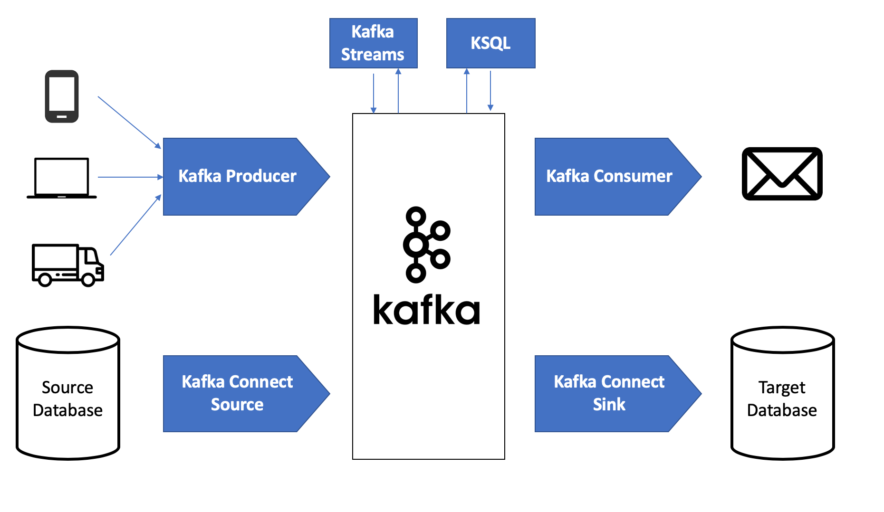

# Apache Kafka: Building Real-Time Systems from First Principles

## 🧠 What Kafka _really_ is (from scratch)

At its core, **Apache Kafka** is:

> A **distributed, append-only, fault-tolerant commit log** used to move **facts about the world** (events) between systems.

An _event_ is just a fact that already happened:

- User clicked "Order"
- Payment succeeded
- Location updated
- Item delivered

**Kafka does NOT process data.**  
**Kafka STORES and MOVES time-ordered facts.**

Everything else (Spark, Flink, ML, alerts) reacts to those facts.

---

## 🧱 Kafka's Mental Model

Think in **three layers**:

1. **Producers** → create events
2. **Kafka Cluster** → stores events safely
3. **Consumers** → react to events

Kafka sits in the middle like a _truth ledger_.

---

## 🔧 Core Kafka Building Blocks

### 1. Topic

A **named stream of events**

Examples: `user_clicks`, `orders`, `payments`

Topics are split internally for scale.

---

### 2. Partition (the secret sauce)

A **partition is an ordered log**.

**Rules:**

- Order is guaranteed **only inside a partition**
- Kafka scales by adding partitions
- Each partition lives on **one broker at a time**


Each message gets an **offset** (0, 1, 2, 3…)  
Offsets are how Kafka remembers _where you are_.

---

### 3. Broker

A **Kafka server**.

- Stores partitions
- Serves reads & writes
- Multiple brokers = Kafka cluster


---

### 4. Producer

- Sends events to a topic
- Chooses partition (round-robin or key-based)
- Does **not** care who consumes

**Producer → fire and forget facts**

---

### 5. Consumer & Consumer Group

Consumers **pull** data (Kafka never pushes).

- A **consumer group** shares work
- Each partition is read by **only one consumer in a group**
- Add consumers → parallelism


---

## 🏗️ Architecture for Kafka Streaming Learning Project

This is a **perfect learning architecture** — simple, realistic, extensible.


### 1️⃣ Event Producer (Application Layer)

- FastAPI backend
- Emits events like:
  - `user_signup`
  - `order_created`
  - `notification_clicked`

These are **facts**, not commands.

---

### 2️⃣ Kafka Cluster (Streaming Backbone)

- 3 brokers (for learning)
- Topics:
  - `raw_user_events`
  - `orders`
  - `notifications`

**Kafka guarantees:**

- Durability
- Ordering (per partition)
- Replayability

---

### 3️⃣ Stream Consumer (Processing Layer)

Python consumer that:

- Reads events
- Cleans / enriches
- Writes to storage or triggers logic

**Later this can become:**

- Spark Streaming
- Flink
- Feature pipeline for ML

---

### 4️⃣ Storage Layer

- S3 / local files → **Bronze**
- Processed tables → **Silver**
- Aggregates → **Gold**

**Remember:** Kafka itself is **not a database** — it's a conveyor belt.

---

### 5️⃣ Decision Layer (Optional but powerful)

- Rule engine
- ML inference
- Notification trigger

Kafka feeds decisions in _near real time_.

---

## � Learning Kafka APIs with Python

We use **`confluent-kafka`** – a production-grade Python client built on librdkafka.



### Four Core APIs:

1. **Producer API** → Write events to topics
2. **Consumer API** → Read events from topics
3. **Admin API** → Create topics, manage cluster
4. **Streams API** → Process streams (not common in Python)

### Quick Example:

```python
# Producer - Fire events
from confluent_kafka import Producer

producer = Producer({"bootstrap.servers": "localhost:9092"})
producer.produce(topic="orders", value='{"user_id": 42}')
producer.flush()
```

```python
# Consumer - React to events
from confluent_kafka import Consumer

consumer = Consumer({
    "bootstrap.servers": "localhost:9092",
    "group.id": "order-service"
})
consumer.subscribe(["orders"])

while True:
    msg = consumer.poll(1.0)
    if msg:
        print(msg.value())
```

**Key insights:**

- Producers are **async** (fast, non-blocking)
- Consumers **pull** data (backpressure is automatic)
- Same key → same partition → **ordering guaranteed**

**Delivery guarantees:**

- **At-most-once**: Fast, possible loss
- **At-least-once**: Safe, duplicates possible (recommended)
- **Exactly-once**: Hard, beautiful problem

---

## �🔁 Why Kafka Beats REST for Streaming

| REST               | Kafka               |
| ------------------ | ------------------- |
| Request → response | Event-driven        |
| Tight coupling     | Loose coupling      |
| No replay          | Replayable history  |
| Bad for scale      | Natural parallelism |

**Key insight:** Kafka lets you **add new consumers without touching producers**.  
That single property is why big companies bet their nervous systems on it.

---

## 🧪 How to Learn Kafka (Recommended Order)

Not commands first. **Concept → failure → fix**.

1. **Single broker** → understand logs
2. **Multiple partitions** → ordering limits
3. **Consumer groups** → parallelism
4. **Offset commit** → at-least-once vs exactly-once
5. **Broker failure** → replication
6. **Rebalancing** → why consumers pause

Kafka teaches systems thinking whether you like it or not.

---

## 🧠 The Powerful Way to Think About Kafka

**Kafka is time, made explicit.**

**Databases answer:**

> "What is true _now_?"

**Kafka answers:**

> "What happened, and in what order?"

Once you see that distinction, streaming architectures stop being confusing and start being inevitable.

---

## 🚀 Next Steps (Orbiting Ideas)

- Kafka vs RabbitMQ (queues vs logs)
- Exactly-once semantics (hard, beautiful problem)
- Kafka → ML feature pipelines
- Why streaming beats batch for user behavior systems

---

## 📝 Project Structure

```
learntools/kafka/
├── README.md              # This file
├── kafka_basics.md        # Detailed notes
└── images/                # Architecture diagrams
```
