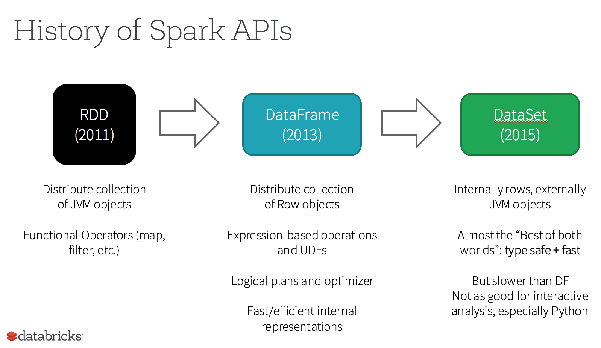
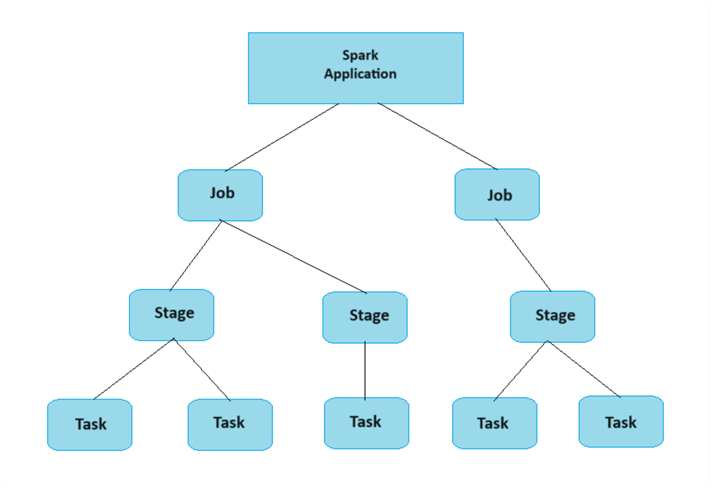
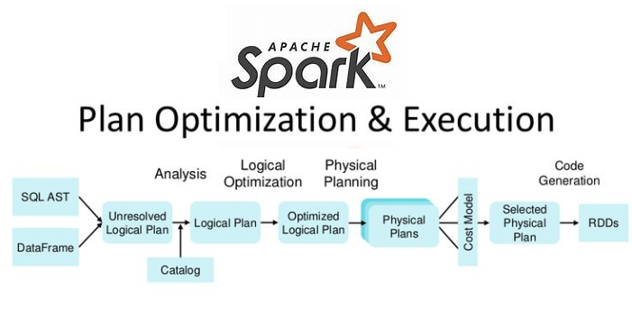
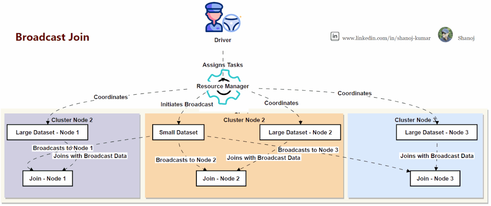
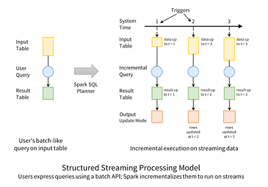

# Apache Spark Fundamentals



---

## Why Spark Exists

**Pandas** = single-machine, in-memory analysis. Works great until:

- CSV is 40+ GB
- Logs arrive continuously
- Joins span billions of rows
- You need fault tolerance

**Spark** = distributed execution engine for cluster-scale data.

---

## Core Differences

| Problem             | Pandas                    | Spark                           |
| ------------------- | ------------------------- | ------------------------------- |
| **Scale**           | MB → few GB               | GB → PB                         |
| **Execution**       | Single machine, in-memory | Distributed cluster             |
| **Fault tolerance** | ❌ (crash = restart)      | ✅ (recomputes lost partitions) |
| **Streaming**       | ❌                        | ✅ (Structured Streaming)       |
| **Parallelism**     | Cores on one box          | Tasks across cluster            |

---

## Spark vs PySpark

- **Spark**: Engine written in Scala, runs on JVM
- **PySpark**: Python API to control Spark

Python is the steering wheel. Spark is the engine.

---

## When to Use What

**Pandas**

- Quick exploration, small tables
- Debugging transformations
- Visualization

**Spark**

- Data exceeds RAM
- Production ETL pipelines
- Streaming (Kafka → Spark → Storage)
- Fault-tolerant processing

**Rule**: Use Pandas for thinking, Spark for moving and scaling data.

---

## How Spark Works (Architecture)


**Key Components**:

- **Driver**: Plans the job, creates DAG
- **Executors**: Muscle that does the work
- **Partitions**: Slices of data
- **Tasks**: Work units per partition (1 partition → 1 task → 1 CPU core)



**Lazy Evaluation**:



- Operations build a DAG (Directed Acyclic Graph)
- Nothing runs until an _action_ (`count`, `collect`, `write`)
- Enables query optimization + fault recovery

**Key idea**: "Bring code to data, not data to code."

Spark partitions data → spreads across machines → executes in parallel.

---

## 7 Production Rules

### Rule 1: Transformations Are Cheap, Shuffles Are Expensive

**Narrow Transformations** (fast, no shuffle):

- `select`, `filter`, `map`, `withColumn`
- Data stays in same partition
- Single stage execution

**Wide Transformations** (slow, shuffle required):

- `groupBy`, `join`, `distinct`, `orderBy`
- Data moves across network + disk
- Multiple stages

**Minimize shuffles to increase performance.**

---

### Rule 2: Partitions Control Parallelism

```python
df.rdd.getNumPartitions()  # default: 200
```

**1 partition → 1 task → 1 CPU core**

```python
df.repartition(200)   # full shuffle (expensive)
df.coalesce(20)       # reduce partitions (cheap, no shuffle)
```

- Large datasets → increase partitions
- Small datasets → decrease partitions

---

### Rule 3: Joins Decide Your Fate



**Shuffle Join** (default, slow):

```python
df1.join(df2, "user_id")  # hash → shuffle → match across machines
```

**Broadcast Join** (fast):

```python
from pyspark.sql.functions import broadcast
df1.join(broadcast(df2), "user_id")  # small df → all executors
```

Use broadcast for small dimension tables (<10MB).

---

### Rule 4: Caching Is Your Friend (Use With Intent)

```python
df.cache()      # lazy caching
df.persist()    # different storage levels
df.count()      # action triggers caching
```

**Cache when**:

- Reusing datasets multiple times
- Iterative algorithms (ML, GraphX)

**Avoid when**:

- One-time use
- Limited memory

**Blind caching = executor OOM.**

---

### Rule 5: Spark SQL Is Not Optional

```python
df.createOrReplaceTempView("users")
spark.sql("SELECT * FROM users WHERE age > 21").show()
```

**Under the hood**:

- Catalyst Optimizer
- Logical Plan → Optimized Plan → Physical Plan

Real pipelines mix DataFrame API + Spark SQL for optimal performance.

---

### Rule 6: Storage Format = Performance Multiplier

**Data Layers**:

- **Bronze**: Raw ingestion (Kafka dumps)
- **Silver**: Cleaned, typed, deduplicated
- **Gold**: Aggregated, business-ready

**Use Parquet/ORC over CSV/JSON**:

```python
df.write.mode("overwrite").parquet("output/data_parquet")
```

**Why Parquet**:

- Columnar storage (faster reads)
- Compressed (saves space)
- Schema-aware
- Industry standard

**Optimization**:

- Partition by frequently filtered columns
- Use bucketing for large joins

---

### Rule 7: Structured Streaming for Real-Time



**Streaming = infinite table + micro-batches**

```python
spark.readStream\
    .format("kafka")\
    .option("subscribe", "events")\
    .load()
```

Same DataFrame API for batch and streaming.

**Use case**: Kafka → Spark → S3/Snowflake pipeline.

---

## Learning Path

### Phase 1: Fundamentals

- Cluster, Driver, Executors
- Partitions & Shuffle
- DAG, Stages, Tasks

### Phase 2: Core APIs

- DataFrame API (not RDDs)
- `select`, `filter`, `groupBy`, `join`
- Window functions, caching

### Phase 3: Data Engineering

- Read from S3/HDFS
- Write Parquet
- Schema evolution

### Phase 4: Streaming

- Structured Streaming
- Kafka → Spark → Storage
- Watermarks, exactly-once semantics

### Phase 5: Production

- Partitioning strategies
- Broadcast joins
- Memory tuning
- Failure handling

## Key Takeaway

Spark isn't magical—it respects physics: memory, network, time, failure.

Master **why** Pandas fails, **why** shuffles are expensive, **why** partitions matter → then Spark feels inevitable.
